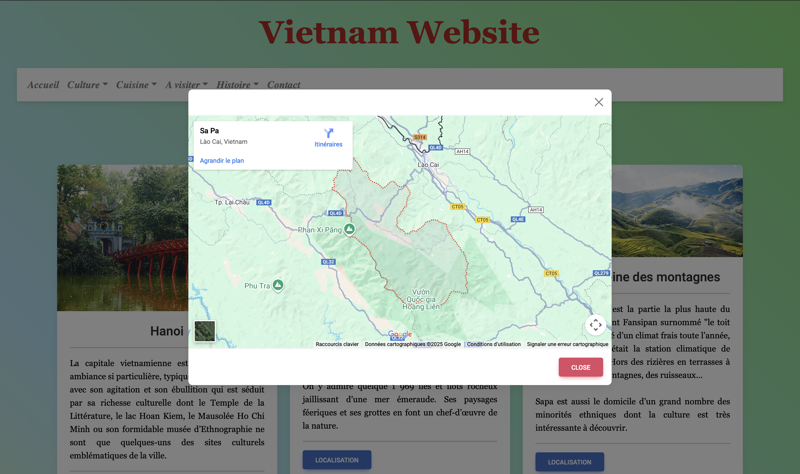

# 🇻🇳 Vietnam Website – Site Culturel sur le Vietnam

**Vietnam Website** est un site web informatif et culturel dédié au **Vietnam**, pays d’origine de ma famille.  
Ce projet a pour but de faire découvrir le pays à travers ses **traditions, sa cuisine, son histoire, sa religion et sa culture**, via un site web complet et illustré.

> 🌱 Ce projet a été réalisé en 2023 dans le cadre de mon admission à la formation [Web@cadémie](https://www.webacademie.org).

---

## 📌 Présentation du projet

Le site présente différents aspects du Vietnam à travers plusieurs rubriques thématiques :
- L’histoire et la dynastie impériale
- La gastronomie traditionnelle (pho, bo bun, banh bao…)
- Les religions et croyances (bouddhisme, confucianisme, culte des ancêtres…)
- Les coutumes et fêtes (Nouvel An Tết, mi-automne…)
- Les lieux incontournables à visiter

---

## 🧩 Objectifs pédagogiques

- Structurer un site statique avec PHP
- Générer dynamiquement les pages avec **header/footer inclus**
- Intégrer un **formulaire de contact fonctionnel avec PHPMailer**
- Appliquer un **design responsive avec Bootstrap**
- Organiser l’arborescence des fichiers proprement

---

## 🗂️ Structure du projet

```
vietnam_website/
├── composer.json / composer.lock
├── PHPMailer/
├── public/
│   ├── css/
│   ├── js/
│   └── img/
├── views/
│   ├── accueil.php
│   ├── recette.php
│   ├── religion.php
│   ├── chronologie.php
│   ├── coutume.php
│   ├── famille_royal.php
│   ├── incontournable.php
│   ├── contact.php
└── README.md
```

---

## ⚙️ Installation

1. Cloner le dépôt :
```bash
git clone https://github.com/zpilia/vietnam_website.git
cd vietnam_website
```

2. Installer les dépendances :
```bash
composer install
```

3. Lancer un serveur local (XAMPP, Laragon, MAMP…) et accéder à :
```
http://localhost/vietnam_website/public/
```

---

## 💬 Fonctionnalités

- 🏠 Page d’accueil intuitive
- 🍲 Découverte des spécialités vietnamiennes
- 🕍 Rubrique religieuse
- 🧧 Fêtes et coutumes
- 🏯 Chronologie impériale
- 📬 Formulaire de contact avec PHPMailer

---

## 🎨 Design

- Palette asiatique rouge et or
- Bootstrap pour le responsive
- Images authentiques du Vietnam
- Navigation fluide entre les rubriques

---

## 🖼️ Aperçu

<p align="center">
  
</p>
<p align="center">
  
</p>
<p align="center">
  
</p>
<p align="center">
  
</p>

---

## 🤝 Auteur

Développé par [zpilia](https://github.com/zpilia)

Projet réalisé dans le cadre de l’admission à la formation **Web@cadémie**

---

## 🪪 Licence

© zpilia — Tous droits réservés.  
L’usage, la reproduction ou la distribution sont soumis à autorisation.

---

# 🇬🇧 English Version

# 🇻🇳 Vietnam Website – Cultural Website About Vietnam

**Vietnam Website** is a cultural and informative website dedicated to **Vietnam**, the native country of my family.  
This project introduces Vietnam’s **traditions, food, history, religion, and culture** through a well-structured and illustrated website.

> 🌱 Created in 2023 as part of my admission to the [Web@cadémie](https://www.webacademie.org) program.

---

## 📌 Project Overview

It highlights key cultural topics:
- History & Imperial Dynasty
- Vietnamese cuisine (pho, bo bun, banh bao…)
- Religions (Buddhism, Confucianism, ancestor worship)
- Customs & traditional festivals (Tết, Mid-Autumn Festival…)
- Famous landmarks and must-see locations

---

## 🧩 Learning Goals

- Build a static website using PHP
- Use **dynamic page generation** with headers/footers
- Add a working **contact form with PHPMailer**
- Apply **responsive design with Bootstrap**
- Keep project structure modular and clean

---

## 🗂️ Project Structure

```
vietnam_website/
├── composer.json / composer.lock
├── PHPMailer/
├── public/
│   ├── css/
│   ├── js/
│   └── img/
├── views/
│   ├── accueil.php
│   ├── recette.php
│   ├── religion.php
│   ├── chronologie.php
│   ├── coutume.php
│   ├── famille_royal.php
│   ├── incontournable.php
│   ├── contact.php
└── README.md
```

---

## ⚙️ Setup

1. Clone the repository:
```bash
git clone https://github.com/zpilia/vietnam_website.git
cd vietnam_website
```

2. Install PHP dependencies:
```bash
composer install
```

3. Run it locally with XAMPP, MAMP or Laragon:
```
http://localhost/vietnam_website/public/
```

---

## 💬 Features

- 🏠 Homepage
- 🍲 Vietnamese culinary specialties
- 🕍 Religion overview
- 🧧 Traditional customs and holidays
- 🏯 Vietnamese imperial timeline
- 📬 PHPMailer contact form

---

## 🎨 Design & UX

- Red & gold colors inspired by Vietnamese culture
- Responsive with Bootstrap
- Authentic photos of Vietnam
- Smooth navigation

---

## 🖼️ Preview

<p align="center">
  
</p>
<p align="center">
  
</p>
<p align="center">
  
</p>
<p align="center">
  
</p>

---

## 👤 Developed by

Created by [zpilia](https://github.com/zpilia)

Built during the **Web@cadémie admission process**

---

## 🪪 License

© zpilia — All rights reserved.  
Use, reproduction or distribution requires permission.
